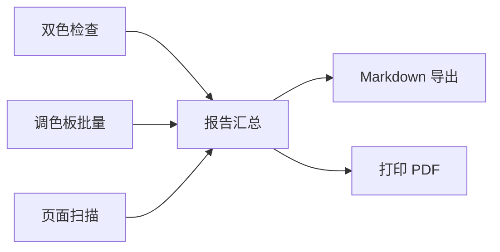

## 1. 产品概述

无障碍配色对比度审计 SPA 是一款面向设计师和前端开发者的本地工具，用于检查和优化色彩对比度以符合 WCAG 无障碍标准。对标 Stark 简版本地版，提供双色检查、调色板批量审计、色盲模拟、图片取样等功能。

- **核心价值**：快速验证配色方案的可访问性，确保产品对所有用户（包括色觉障碍用户）友好
- **目标用户**：UI/UX 设计师、前端开发者、可访问性审计人员
- **产品定位**：轻量级、纯前端、本地运行的对比度审计工具

## 2. 核心功能

### 2.1 功能模块

1. **双色检查器**：单组前景/背景色对比度实时计算与预览
2. **调色板批量检查**：导入 design-tokens.json，自动配对语义角色并批量审计
3. **色盲模拟**：模拟 protanopia/deuteranopia/tritanopia 三种色盲视觉效果
4. **图片取样**：上传图片点击取色，计算实际界面元素对比度
5. **页面扫描（有限）**：手动输入 URL 列表，解析常见选择器的 computed style
6. **报告导出**：生成 Markdown 报告，支持打印 CSS 导出 PDF

### 2.2 页面详情

| 页面名称 | 模块名称 | 功能描述 |
|---------|---------|----------|
| 双色检查 | 颜色输入区 | HEX/RGB/HSL 三种输入格式，支持互换前景背景 |
| 双色检查 | 结果展示区 | 对比度 ratio（2位小数）、AA/AAA 判定（正文/大字） |
| 双色检查 | 实时预览区 | 14px 正文 / 18px bold 大字预览样例 |
| 调色板批量 | Token 导入 | JSON 文件导入 / 粘贴 JSON 文本 |
| 调色板批量 | 配对表格 | 语义角色配对结果，pass/fail 状态 |
| 调色板批量 | 建议色生成 | 微调亮度直至 4.5:1 的启发式算法 |
| 色盲模拟 | 并排预览 | 正常视觉与三种色盲效果并排对比 |
| 色盲模拟 | 自定义图片 | 支持上传图片进行色盲模拟预览 |
| 图片取样 | Canvas 取色 | 上传图片后点击两点取前景/背景色 |
| 报告 | 失败清单 | 汇总所有不通过项及其对比度数值 |
| 报告 | 建议色 | 为每个失败项推荐修正后的颜色 |
| 报告 | 导出功能 | Markdown 导出 / 打印 PDF |

## 3. 核心流程

### 3.1 双色检查流程
用户输入前景色和背景色 → 系统实时计算相对亮度 → 计算对比度 ratio → 判断 AA/AAA 通过状态 → 渲染预览文字

### 3.2 调色板批量检查流程
用户导入 design-tokens.json → 解析语义颜色对（如 onPrimary/primary）→ 逐对计算对比度 → 生成结果表格 → 对失败项生成建议色

### 3.3 报告生成流程
汇总各模块失败项 → 附带原始数值与建议色 → 生成 Markdown 格式报告 → 支持浏览器打印导出 PDF

## 4. 用户界面设计

### 4.1 设计风格
- **设计方向**：专业工具型 / 高对比度编辑风格
- **主色调**：深灰底色（#1a1a1a）+ 琥珀色强调（#f59e0b）- 体现工具的精准与专业感
- **辅助色**：绿色表示通过（#10b981）、红色表示失败（#ef4444）
- **字体**：等宽字体 JetBrains Mono 用于数值展示，Inter 用于界面文字
- **布局**：左侧导航 + 右侧内容区，卡片式模块布局
- **图标风格**：线性简洁图标，使用 lucide-react

### 4.2 页面设计概览

| 页面名称 | 模块名称 | UI 元素 |
|---------|---------|---------|
| 双色检查 | 颜色输入区 | 两个大尺寸颜色选择器卡片，带 swap 按钮 |
| 双色检查 | 结果展示区 | 大字号 ratio 数字，AA/AAA 徽章矩阵 |
| 双色检查 | 预览区 | 白底/黑底双预览卡片，14px/18px 文字样例 |
| 调色板批量 | 导入区 | 拖拽上传 + 文本输入切换 |
| 调色板批量 | 结果表格 | 斑马纹表格，带 pass/fail 状态徽章 |
| 调色板批量 | 建议色 | 原始色与建议色并排对比条 |
| 色盲模拟 | 预览网格 | 2x2 网格：正常 / Protan / Deutan / Tritan |
| 报告 | 统计概览 | 总数 / 通过数 / 失败数 统计卡片 |
| 报告 | 失败列表 | 可展开的失败项详情卡片 |

### 4.3 响应式
- 桌面端：左侧固定导航 + 右侧内容区
- 平板端：顶部导航 + 内容区自适应
- 移动端：底部标签栏导航，单列布局

### 4.4 微交互
- 颜色变化时结果数值有平滑过渡动画
- Pass/fail 徽章带呼吸效果提示状态
- 表格行悬停时高亮
- 页面切换时内容区淡入过渡
