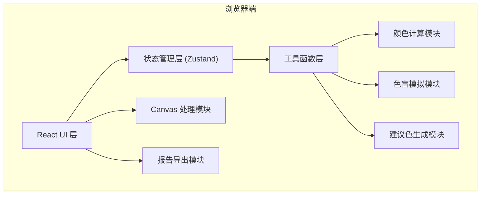

## 1. 架构设计

本项目为纯前端 SPA 应用，无后端服务，所有计算在浏览器本地完成。



## 2. 技术描述

- **前端框架**：React@18 + TypeScript
- **构建工具**：Vite@5
- **样式方案**：TailwindCSS@3
- **状态管理**：Zustand
- **路由管理**：react-router-dom@6
- **图标库**：lucide-react
- **开发模式**：纯前端本地运行，无后端依赖

## 3. 路由定义

| 路由路径 | 页面组件 | 功能描述 |
|---------|---------|----------|
| `/` | ContrastChecker | 双色对比度检查器 |
| `/palette` | PaletteAudit | 调色板批量审计 |
| `/simulate` | ColorblindSimulate | 色盲模拟 |
| `/report` | ReportPage | 报告汇总与导出 |

## 4. 核心数据模型

### 4.1 颜色相关类型

```typescript
interface RGB {
  r: number;
  g: number;
  b: number;
}

interface HSL {
  h: number;
  s: number;
  l: number;
}

interface ColorResult {
  hex: string;
  rgb: RGB;
  hsl: HSL;
  luminance: number;
}
```

### 4.2 对比度结果类型

```typescript
interface ContrastResult {
  ratio: number;
  passAANormal: boolean;
  passAALarge: boolean;
  passAAANormal: boolean;
  passAAALarge: boolean;
}

interface TokenPair {
  fg: string;
  bg: string;
  role: string;
  ratio: number;
  passAA: boolean;
  passAAA: boolean;
  suggestedFg?: string;
  suggestedBg?: string;
}
```

### 4.3 Design Tokens 格式

```typescript
interface DesignTokens {
  colors: Record<string, string>;
  pairs?: Array<{
    foreground: string;
    background: string;
    role: string;
  }>;
}
```

### 4.4 色盲类型

```typescript
type ColorblindType = 'protanopia' | 'deuteranopia' | 'tritanopia';
```

## 5. 项目目录结构

```
src/
├── components/          # 可复用组件
│   ├── ColorPicker/     # 颜色选择器组件
│   ├── ContrastBadge/   # 对比度通过徽章
│   ├── Layout/          # 布局组件（导航、侧边栏）
│   ├── PreviewCard/     # 预览卡片
│   └── StatusBadge/     # 状态徽章
├── pages/               # 页面组件
│   ├── ContrastChecker/ # 双色检查页
│   ├── PaletteAudit/    # 调色板批量审计页
│   ├── ColorblindSimulate/ # 色盲模拟页
│   ├── ImageSampler/    # 图片取样（作为模拟页子模块）
│   └── ReportPage/      # 报告页
├── utils/               # 工具函数
│   ├── color.ts         # 颜色转换与对比度计算
│   ├── colorblind.ts    # 色盲模拟算法
│   ├── suggest.ts       # 建议色生成算法
│   ├── tokens.ts        # Design Tokens 解析
│   └── report.ts        # 报告生成
├── hooks/               # 自定义 Hooks
│   ├── useColorInput.ts # 颜色输入管理
│   └── useFileUpload.ts # 文件上传处理
├── store/               # Zustand 状态
│   └── auditStore.ts    # 审计结果全局状态
├── types/               # 类型定义
│   └── index.ts
├── App.tsx
├── main.tsx
└── index.css
```

## 6. 核心算法说明

### 6.1 相对亮度计算 (WCAG)
```
L = 0.2126 * R + 0.7152 * G + 0.0722 * B
其中 R/G/B 为 sRGB 线性化后的值（gamma 校正）
```

### 6.2 对比度计算
```
contrast = (L1 + 0.05) / (L2 + 0.05)  // L1 > L2
```

### 6.3 WCAG 标准
- AA 级：正文 ≥ 4.5，大字 ≥ 3.0
- AAA 级：正文 ≥ 7.0，大字 ≥ 4.5

### 6.4 建议色生成（二分搜索）
在保持色相近似的前提下，通过二分搜索调整前景色亮度，直至对比度 ≥ 4.5（AA 级标准）。

### 6.5 色盲模拟
使用 SVG color matrix 滤镜矩阵，对每个像素进行颜色空间变换：
- Protanopia（红色盲）
- Deuteranopia（绿色盲）
- Tritanopia（蓝色盲）
